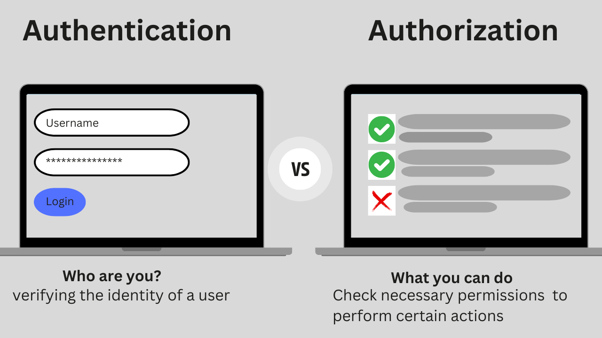

# authentication-and-authorisation-with-expressjs

# User Account Deletion After Authentication

## Introduction

In modern web applications, managing and administering the app is crucial for maintaining a secure and user-friendly application. One key feature often discussed is the ability for admins and users to delete accounts. This functionality is typically considered after a user is authenticated. This document explores whether allowing users to delete their accounts post-authentication is a good idea, and provides clarity on the concepts of authentication and authorization.

## Authentication vs Authorization

Before diving into the specifics of user account deletion, it’s essential to understand the difference between **authentication** and **authorization**:

- **Authentication**: This is the process of verifying the identity of a user. When a user logs in, the system checks if the credentials they provide (e.g., username and password) match those stored in the system. Authentication confirms that a user is who they claim to be.

- **Authorization**: This determines what an authenticated user is allowed to do. Once authenticated, authorization checks if the user has the necessary permissions to access specific resources or perform certain actions, such as deleting an account.

## Is Deleting a User After Authentication a Good Idea?

**Yes, it is a good idea, infact it is necessary due to the following:**

1. **Security**: This is to ensure that the account deletion process is secure.

2. **Implementation Considerations**: The deletion functionality should be implemented carefully to avoid unintended data loss. Therefore, only when an identity is known can it's authorization be confirmed.

## Summary

**Authentication** and **authorization** are two distinct security concepts. Authentication verifies who you are, whereas authorization defines what you're allowed to do. So, saying that "delete user functionality can be done after authentication" only addresses one part of the equation.
